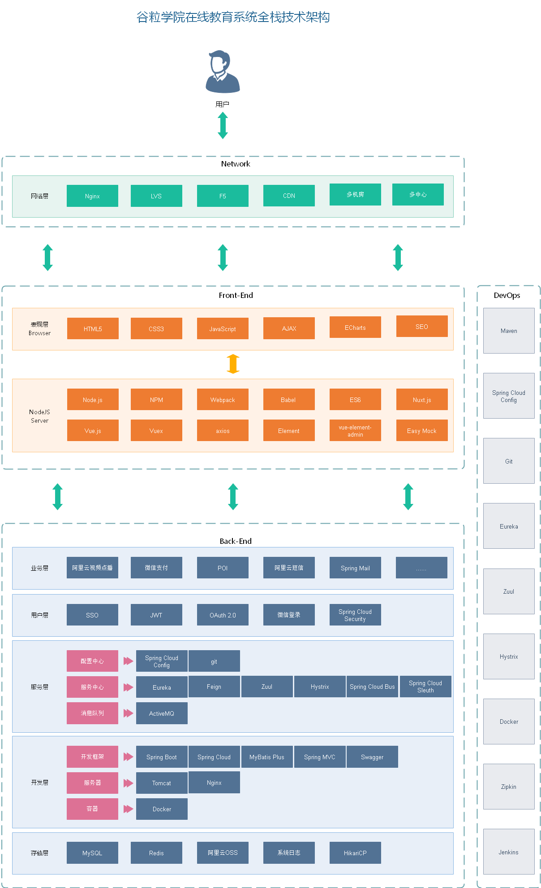

# 谷粒学院全栈开发项目

### 交流方式：

QQ技术交流群：863662849

### 一、项目背景和概述

（1）在线教育项目B2C模式，分为后台运营平台和前台用户平台

（2）在线教育项目采用前后端分离开发

（3）在线教育项目模块：

    课程中心（后台管理部分，前台展现，前台视频播放）
    讲师中心（后台管理部分，前台展现）
    统计分析（图表展现，比如柱状图）
    用户中心

（4）在线教育技术：

    阿里云oss
    阿里云视频点播
    echarts图表
    poi批量操作
    springCloud相关组件
    nginx    
    vue、es6、nodejs
    nuxt
    element-ui
    easy mock
    postman

### 二、业务架构图

### 三、技术架构图

